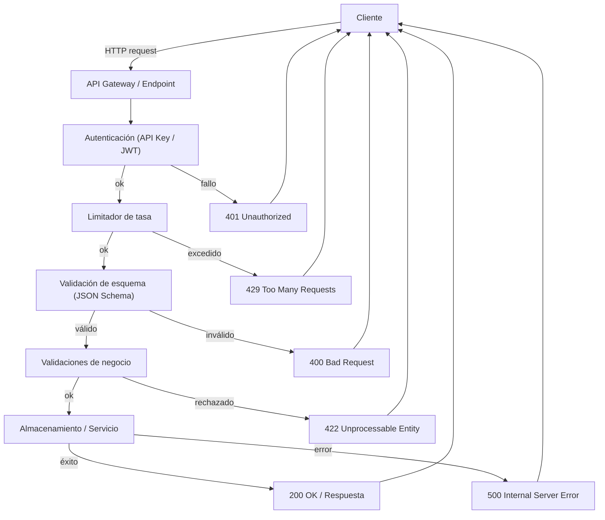
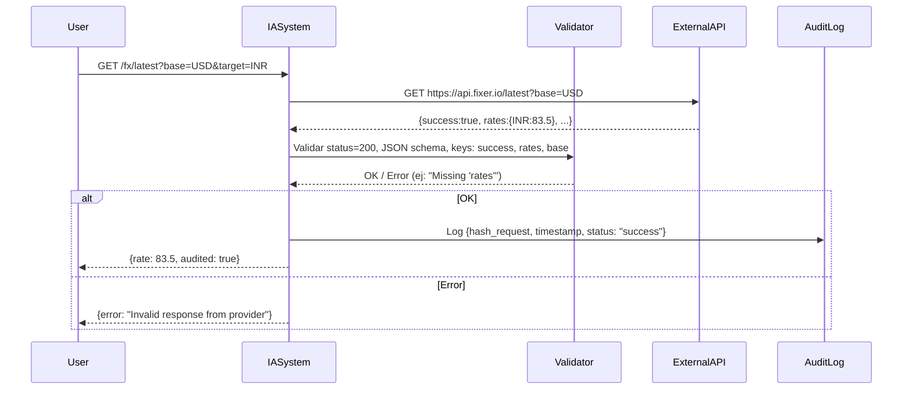
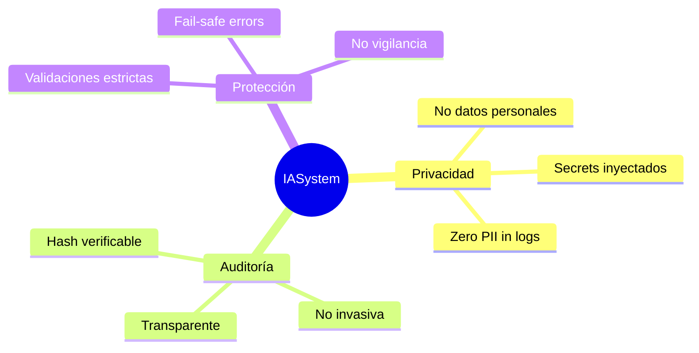

# Diagramas técnicos de IASystem

Este archivo contiene los esquemas de arquitectura, flujo de decisión y auditoría con blockchain.

## Visualizaciones renderizadas (SVG)

### Flowchart — Validación de API

### Secuencia — Validación contra proveedor externo

### Mapa mental — Principios

